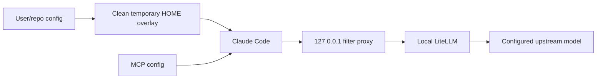

# Architecture and trust boundaries

The launcher checks LiteLLM health, starts a loopback filter, strips unsupported request fields, rewrites blocked model identifiers, creates a temporary clean home, overlays approved configuration, and launches Claude with the proxy as its API base.

The user controls the trust boundaries: the LiteLLM process, upstream model provider, MCP commands, and any shell-capable agent all receive only the credentials and filesystem scope the operator chooses to expose.
